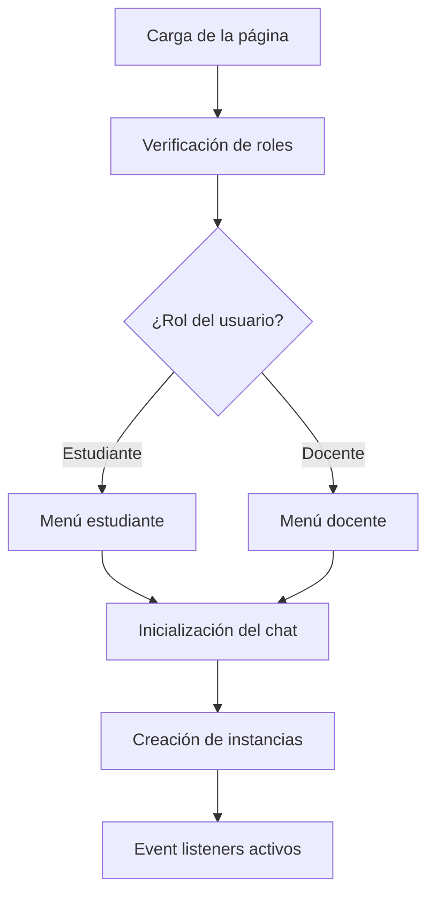
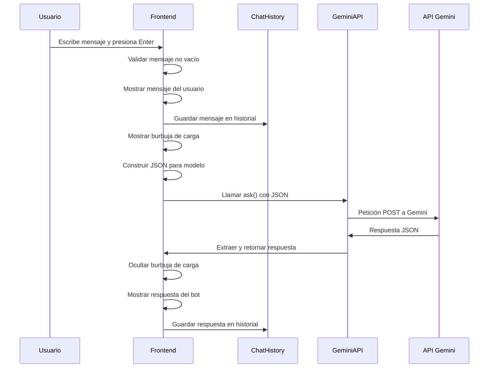

# Sistema de Retroalimentación con IA para Docentes

## Descripción General

Este sistema implementa un chat inteligente especializado para docentes que utiliza la API de Google Gemini (gemini-2.0-flash) para proporcionar asistencia en tiempo real sobre temas educativos, metodologías, normativas y cualquier consulta relacionada con la labor docente.

## Arquitectura del Sistema

### 1. Estructura de Archivos
```
resources/views/panel/ia/retroalimentacion.blade.php  # Vista principal del chat
css/panel/retroalimentacion.css                      # Estilos del chat
```

### 2. Componentes Principales

#### A. Interfaz de Usuario (Frontend)
- **Chat Container**: Interfaz visual del chat con diseño moderno
- **Header**: Muestra el título "Asistente IA para Docentes"
- **Chat Area**: Área principal donde se muestran los mensajes
- **Input Area**: Campo de texto y botón para enviar mensajes

#### B. Clases JavaScript

##### 1. Clase `ChatHistory`
**Propósito**: Gestionar el historial de conversaciones con límite de memoria

```javascript
class ChatHistory {
    constructor(maxLength = 5) {
        this.maxLength = maxLength;
        this.history = [];
    }
}
```

**Métodos**:
- `add(role, text)`: Añade un mensaje al historial
  - Mantiene un máximo de 5 mensajes (configurable)
  - Elimina el mensaje más antiguo si se supera el límite
- `getJson()`: Retorna una copia del historial en formato JSON

##### 2. Clase `GeminiAPI`
**Propósito**: Manejar la comunicación con la API de Google Gemini

```javascript
class GeminiAPI {
    constructor(apiKey) {
        this.url = `https://generativelanguage.googleapis.com/v1beta/models/gemini-2.0-flash:generateContent?key=${apiKey}`;
    }
}
```

**Métodos**:
- `ask(jsonData)`: Envía una consulta a la API de Gemini
  - Estructura el request según el formato esperado por Gemini
  - Realiza petición POST con headers JSON
- `extractAnswer(response)`: Extrae la respuesta del objeto JSON devuelto por Gemini

## Flujo Completo del Proceso

### 1. Inicialización del Sistema



**Pasos detallados**:

1. **Carga de la página**: Se carga la vista Blade con todos los componentes
2. **Verificación de autenticación**: El sistema verifica si el usuario está logueado
3. **Determinación de rol**: Se identifica si es estudiante (rol 3) o docente (rol 2)
4. **Carga de menú**: Se incluye el menú correspondiente al rol
5. **Inicialización JavaScript**: Se ejecuta el evento `DOMContentLoaded`

### 2. Configuración Inicial del Chat

```javascript
// Constantes de configuración
const BOT = {
    IMG: "https://cdn-icons-png.flaticon.com/512/4712/4712035.png",
    NAME: "Asistente"
};
const USER = {
    IMG: "https://cdn-icons-png.flaticon.com/512/1946/1946429.png",
    NAME: "Tú"
};

// Inicialización de instancias
const chatHistory = new ChatHistory(5);
const gemini = new GeminiAPI('{{ config('services.gemini.api_key') }}');
```

### 3. Proceso de Envío de Mensaje



**Detalle paso a paso**:

#### Paso 1: Captura del Evento
```javascript
msgerForm.addEventListener("submit", async event => {
    event.preventDefault();
    const msgText = msgerInput.value.trim();
    if (!msgText) return;
```

#### Paso 2: Mostrar Mensaje del Usuario
```javascript
appendMessage(USER.NAME, USER.IMG, "right", msgText, true);
chatHistory.add('USUARIO', msgText);
msgerInput.value = "";
```

#### Paso 3: Indicador de Carga
```javascript
appendLoadingBubble();
```

#### Paso 4: Construcción del JSON para Gemini
```javascript
function buildJsonForModel(history) {
    return {
        historial: history.getJson(),
        instrucciones: "Eres un asistente de inteligencia artificial especializado en apoyar a docentes...",
        contenido_educativo: null,
        mensaje_adicional: "Si la pregunta es muy general, pide más detalles para poder ayudar mejor."
    };
}
```

#### Paso 5: Comunicación con Gemini
```javascript
const jsonForModel = buildJsonForModel(chatHistory);
const response = await gemini.ask(jsonForModel);
const answer = gemini.extractAnswer(response);
```

#### Paso 6: Mostrar Respuesta
```javascript
removeLoadingBubble();
appendMessage(BOT.NAME, BOT.IMG, "left", answer, true);
chatHistory.add('MODELO', answer);
```

## Funciones Utilitarias

### 1. Formateo de Mensajes
```javascript
function formatChatText(text) {
    // Convertir '**palabra**' a <strong>palabra</strong>
    text = text.replace(/\*\*(.*?)\*\*/g, '<strong>$1</strong>');
    
    // Convertir la lista de ítems (con '* **') en un formato con saltos de línea
    text = text.replace(/\* \*\*(.*?)\*\*/g, '<br><strong>$1</strong>');
    
    return text;
}
```

### 2. Gestión de Burbujas de Chat
```javascript
function appendMessage(name, img, side, text, isNew = false) {
    // Crea el HTML para el mensaje
    // Determina la clase CSS según el lado (usuario o bot)
    // Inserta el mensaje en el DOM
    // Hace scroll automático al final
}
```

### 3. Indicadores de Estado
```javascript
function appendLoadingBubble() {
    // Muestra animación de "escribiendo..."
}

function removeLoadingBubble() {
    // Elimina la animación de carga
}
```

## Configuración de la API

### Variables de Entorno
```php
// En config/services.php
'gemini' => [
    'api_key' => env('GEMINI_API_KEY'),
],
```

### Estructura de Request a Gemini
```json
{
    "contents": [
        {
            "role": "user",
            "parts": [
                {
                    "text": "{
                        \"historial\": [...],
                        \"instrucciones\": \"...\",
                        \"contenido_educativo\": null,
                        \"mensaje_adicional\": \"...\"
                    }"
                }
            ]
        }
    ]
}
```

## Características Especiales

### 1. Gestión de Memoria
- **Límite de historial**: 5 mensajes máximo
- **Rotación automática**: Elimina mensajes antiguos
- **Preservación de contexto**: Mantiene coherencia en la conversación

### 2. Especialización Docente
- **Instrucciones específicas**: Configurado para temas educativos
- **Contexto educativo**: Entiende terminología y metodologías
- **Respuestas profesionales**: Formato adecuado para docentes

### 3. Interfaz Adaptable
- **Diseño responsivo**: Funciona en diferentes dispositivos
- **Roles diferenciados**: Menús según el tipo de usuario
- **Feedback visual**: Animaciones y estados de carga

## Manejo de Errores

### 1. Errores de Conectividad
```javascript
try {
    const response = await gemini.ask(jsonForModel);
    // ... procesamiento exitoso
} catch {
    removeLoadingBubble();
    appendMessage(BOT.NAME, BOT.IMG, "left", "Error al conectar con la IA.", true);
}
```

### 2. Validaciones
- **Mensaje vacío**: Se ignora si el input está vacío
- **Respuesta de API**: Manejo de respuestas malformadas
- **Autenticación**: Verificación de usuario logueado

## Seguridad

### 1. Autenticación
- Verificación de usuario logueado
- Control de acceso por roles

### 2. API Key
- Configuración segura en variables de entorno
- No exposición en código frontend

### 3. Sanitización
- Formateo seguro de texto
- Prevención de XSS mediante formateo controlado

## Personalización

### 1. Límite de Historial
```javascript
const chatHistory = new ChatHistory(5); // Cambiar número según necesidad
```

### 2. Instrucciones del Modelo
```javascript
instrucciones: "Personalizar las instrucciones según el contexto específico"
```

### 3. Avatares y Nombres
```javascript
const BOT = {
    IMG: "URL_personalizada",
    NAME: "Nombre_personalizado"
};
```

## Consideraciones Técnicas

### 1. Rendimiento
- Historial limitado para evitar requests grandes
- Carga asíncrona de respuestas
- Optimización de DOM updates

### 2. Escalabilidad
- Posibilidad de añadir más modelos de IA
- Arquitectura modular para extensiones
- Separación clara de responsabilidades

### 3. Mantenimiento
- Código comentado y estructurado
- Funciones reutilizables
- Configuración centralizada

## Posibles Mejoras

1. **Persistencia de historial**: Guardar conversaciones en base de datos
2. **Temas predefinidos**: Botones con consultas frecuentes
3. **Exportación de conversaciones**: Permitir descargar el chat
4. **Análisis de uso**: Métricas de consultas más frecuentes
5. **Múltiples idiomas**: Soporte para diferentes idiomas
6. **Integración con contenido**: Conectar con material educativo específico

## Dependencias

- **Google Gemini API**: Para procesamiento de IA
- **Laravel Framework**: Backend PHP
- **JavaScript ES6+**: Para funcionalidad del frontend
- **CSS3**: Para estilos y animaciones
- **Font Awesome**: Para iconos

## Conclusión

Este sistema proporciona una interfaz intuitiva y especializada para que los docentes puedan obtener asistencia instantánea sobre temas educativos, metodologías y cualquier aspecto relacionado con su labor profesional. La arquitectura modular permite futuras extensiones y personalizaciones según las necesidades específicas de la institución educativa.
